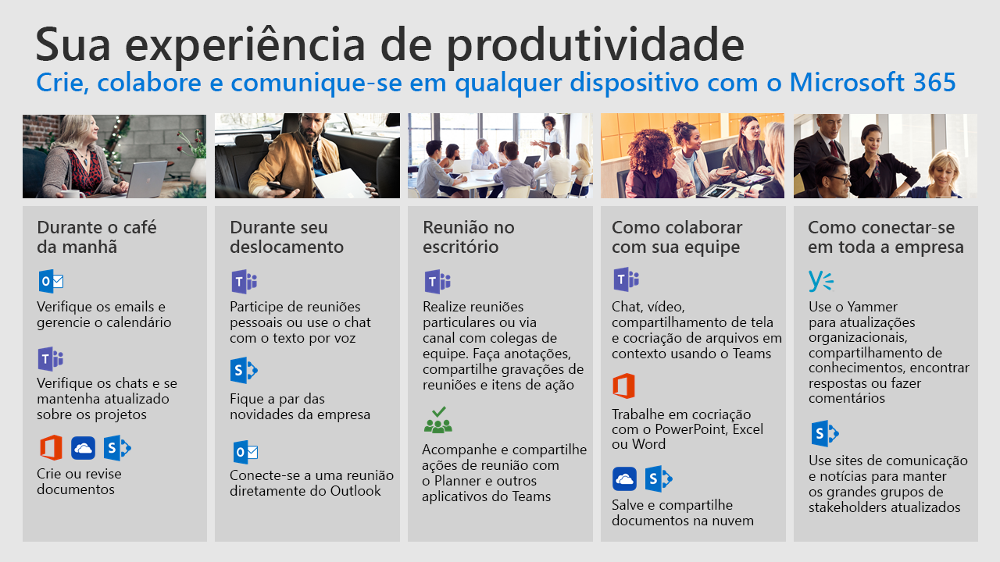

# Dia a dia com o Office 365

Use os serviços de nuvem do Office 365 para melhorar seu trabalho em qualquer dispositivo.  Acompanhe esses cenários comuns e veja como é possível simplificar a colaboração, a comunicação e a criação de conteúdo conforme o dia avança.  

