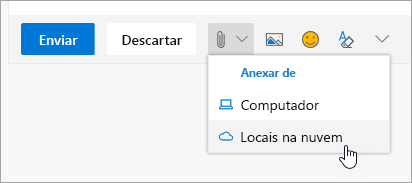

# Colaborando com os ColegasCollaborating with Colleagues

É 14:00 e é hora de colaborar com os colegas.It's 2:00 PM and time to collaborate with colleagues. O Office 365 oferece as melhores oportunidades de colaboração, permitindo que as equipes trabalhem juntas de várias maneiras.Office 365 provides best-in-class opportunities for collaboration, enabling teams to work together in multiple ways. 

## FerramentasTools
- Microsoft TeamsMicrosoft Teams
- Office OnlineOffice Online
- OneNoteOneNote
- SharePoint, OneDriveSharePoint & OneDrive
- 
## Lista de verificação para colaborar com os colegasChecklist for collaborating with colleagues
- Crie ou reúna uma equipe da Microsoft para colaborarCreate or join a Microsoft Team to collaborate
- Crie e compartilhe arquivos do OneDriveCreate and share files from OneDrive 
- Cocriar no Office 365Cocreate in Office 365 
- Use anexos na nuvemUse cloud attachments

## Crie ou reúna uma equipe no Microsoft Teams para colaboraçãoCreate or join a Microsoft Team for collaboration

É no Microsoft Teams e nos canais que as pessoas podem colaborar ao compartilhar arquivos, acompanhar os itens de ação da equipe e muito mais.Microsoft Teams and channels are places where people can collaborate by sharing files, tracking team action items and much more. Cada Microsoft Teams tem uma integração com um site do SharePoint, um bloco de anotações do OneNote e outros ativos.Every Microsoft Teams has an integration into a SharePoint site, a OneNote notebook, and other assets. A melhor utilização desse serviço do Office 365 é por pessoas que trabalhem em conjunto com frequência em projetos ou resultados compartilhados.This service of Office 365 is best used for people who work together frequently on shared projects or outcomes. 

## Compartilhe arquivos do seu OneDriveShare Files from your OneDrive
É possível compartilhar os arquivos salvos no OneDrive for Business com todos os navegadores ou aplicativos de área de trabalho do Office 365, como o Word ou o Excel.Files that have been saved on OneDrive for Business can be shared with anyone either from the browser or Office 365 desktop applications like Word or Excel. É possível compartilhar com pessoas que usem um nome, alias ou endereço de email da empresa.It is possible to share with individuals using their name, alias, or company email address. 

## Crie em conjunto no Office 365Co-create in Office 365
A coautoria é quando trabalhamos simultaneamente com colegas no mesmo arquivo.Co-creation is when we work simultaneously with colleagues on the same file. Isso é possível nas versões baseadas na Web dos principais aplicativos do Office 365 e nas versões da área de trabalho dos aplicativos a partir do Office 2016.This is possible in the web-based versions of the core Office 365 apps and in the desktop versions of those applications from Office 2016 onward.  Economize tempo e trabalhe em conjunto no mesmo documento, e o Office sincronizará essas alterações para você, mesmo que alguém esteja off-line.Save time and work together on the same document and Office will synchronize those changes for you, even if one of you is offline. 

## Use anexos na nuvem: pare de enviar aquela planilha por email!Use Cloud Attachments - Stop Emailing that Spreadsheet!
Quantas vezes você teve que procurar a versão correta de um documento que foi anexado a um email?How many times have you had to hunt for the right version of a document when it was attached to an email? Agora, no Office 365, você pode compartilhar um link para o arquivo, chamado de anexo na nuvem, para que todos editem a mesma versão.Now in Office 365 you can share a link to the file, called a cloud attachment, so that everyone is editing the same version.  Você pode optar por enviar um link e também determina se as pessoas podem ou não exibir ou editar o arquivo.You can chose to either send a link and whether or not people can view or edit the file. 

