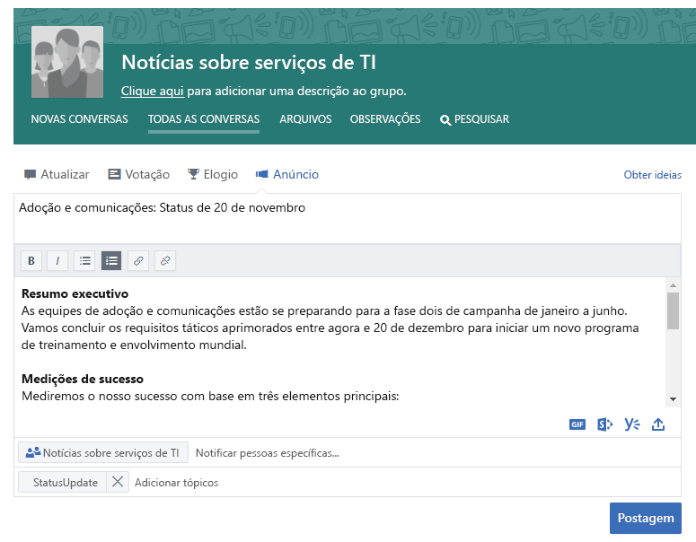
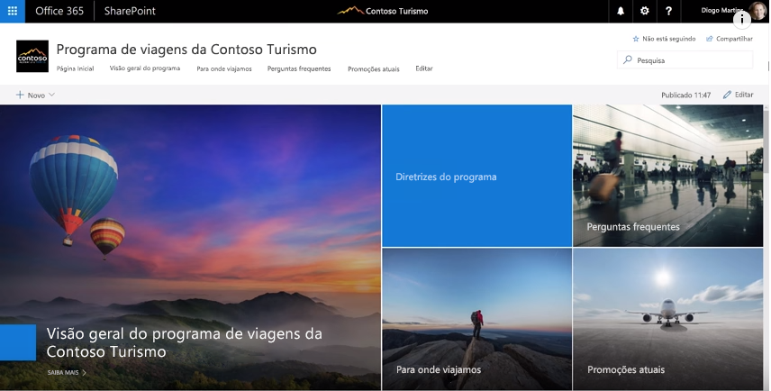
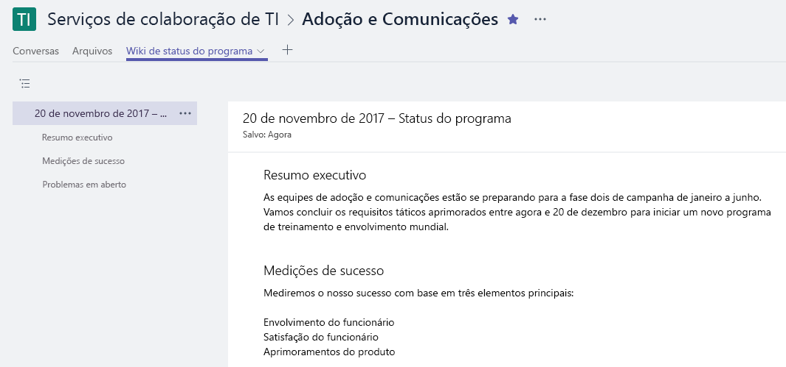

# Conectando-se à empresa

É um dia ocupado, mas antes de sair do escritório, você deseja garantir que todas as pessoas interessadas em seu trabalho sejam informadas sobre o que está acontecendo. Garantir que todos os seus participantes, dentro e fora da sua equipe, entendam seus objetivos, progresso e resultados é uma parte importante do que você faz.  

## Ferramentas
- SharePoint
- Yammer
- Outlook
- Microsoft Teams 

## Lista de verificação para comunicação pela empresa
- Entender seu público e seus métodos de comunicação existentes
- Direcionar as principais mensagens por pessoa, por exemplo, participantes do projeto, membro da equipe ou funcionário
- Selecionar ferramentas de comunicação que se complementam, por exemplo, criar uma postagem na sua comunidade do Yammer e enviar um alerta por email 
- Coautoria suas informações com outras pessoas em sua equipe
- Publicar suas informações e enviar uma notificação para todas as suas partes interessadas 
 
## Selecione seu método de comunicação
Use as informações abaixo para decidir a melhor maneira de se comunicar com sua equipe. Equilíbrio usando novas tecnologias com comunicados de email tradicionais enquanto as pessoas migram para novos métodos de comunicação. Ter uma abordagem de comunicação consistente é uma maneira eficaz de direcionar a conscientização e a alteração organizacional. 

**Yammer**: você pode orientar a conversa em um amplo grupo de pessoas usando o Yammer para compartilhar suas atualizações. Poste uma atualização padrão ou use o recurso de anúncio para garantir que uma cópia da sua atualização vá para a caixa de correio de cada membro. 

**SharePoint**: se você deseja acessar pessoas de fora do seu grupo de trabalho, considere escrever um breve artigo de notícias sobre seu compromisso e progresso prontamente disponível e mantido para a vida útil do seu projeto no SharePoint Online. Use uma página moderna em um site de equipe do SharePoint ou para um programa maior, considere a criação de um site de comunicação do SharePoint. 

Os sites de comunicação do SharePoint fornecem artigos visuais e flexíveis de notícias que permitem que você incorpore imagens, painéis e texto juntos. As informações são disponibilizadas por meio de qualquer navegador ou através do aplicativo móvel do SharePoint. Este vídeo fornece uma rápida visão geral do que esses sites poderosos podem fazer. Para garantir a melhor visibilidade fixar o site de comunicação como uma guia para o seu grupo de trabalho no Microsoft Teams.

**Microsoft Teams**: se esse grupo abrangente de pessoas já fizer parte do seu grupo de trabalho no Microsoft Teams por que não postar uma nota em seu canal geral com fatos importantes e um link para uma página wiki para sua atualização mais longa.  As páginas wiki podem ser coautodas por várias pessoas e persistirem durante a vigência da equipe. 

## Dica para modernizar sua comunicação

**Para seus colegas de email centrados**: Assine-os para alertas do seu grupo do Yammer ou do seu feed de notícias do SharePoint.  Dessa forma, eles receberão uma notificação em seus emails de que você publicou novas informações e pode clicar nas informações de origem sem precisar criar um email separado.  Deseja obter o snazzy?  Personalizar a notificação com o Microsoft Flow ou o PowerApps. Considere ter um brownbag para mostrar esses usuários como usar o Microsoft Teams, o SharePoint ou o yammer em seus dispositivos móveis. 

**Obter pessoas conversando!** Incentive o envolvimento ativando comentários para suas páginas de site de comunicação do SharePoint.  Se você estiver usando o Yammer, verifique se as pessoas participam de sua comunidade monitorando-as regularmente para perguntas que você pode responder. 

**Compartilhar externamente**: o Microsoft Teams, o SharePoint e o Yammer têm suporte para compartilhamento externo se o administrador permitir isso na sua instância do Office 365.  Usando o compartilhamento externo, você pode compartilhar suas atualizações com pessoas que trabalham para parceiros, fornecedores e, naturalmente, seus clientes.