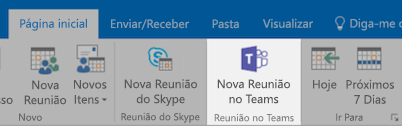
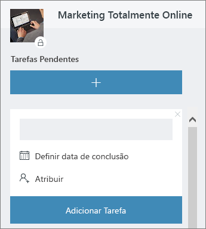

# Reunião no escritórioMeeting at the Office

São 10h e hora da reunião.It's 10:00 AM and time for your meeting. Nesta seção, vamos mostrar como deixar suas reuniões mais produtivas.In this section, we'll show you how to make your meetings more productive.  Isso envolve as práticas recomendadas para a preparação da reunião e as ferramentas do Office 365.This involves best practices for meeting preparation and Office 365 tools.  

## FerramentasTools
- OutlookOutlook
- Microsoft TeamsMicrosoft Teams
- Skype for BusinessSkype for Business
- OneNoteOneNote

## Lista de verificação para a reuniãoChecklist for your meeting
- Planejar e agendar a reuniãoPlan and book your meeting
- Ingressar em uma reuniãoJoin a meeting
- Apresentar informações em uma reuniãoPresent information in a meeting
- Usar o OneNote em uma reunião para coautoria e anotaçõesUse OneNote in a meeting for co-creation and notes
- Usar o Planner em uma reunião para acompanhar itens de ação do projetoUse Planner in a meeting to track action items for that project
- Finalizar uma reuniãoEnd a meeting
 
## Planejar e agendar a reuniãoPlan and book your meeting
Há algumas coisas que você pode fazer para garantir que a reunião seja o mais produtiva possível:There are a few things you can do to ensure your meeting is as productive as possible:

1. **Precisa fazer uma reunião?****Do you need a meeting?** Primeiro, considere compartilhar um arquivo no chat com os aprovadores necessários.Consider sharing a file in chat with the necessary approvers first.  
1. **Tenha uma pauta limpa.****Have a clear agenda.**  Inclua a pauta da reunião na seção de notas do convite online, para que os participantes possam estar preparados.Include your meeting agenda in the notes section of your online meeting invitation so attendees can be prepared.
1. **Grave a reunião** Use as funções de gravação de reunião do Microsoft Teams para compartilhar a reunião com pessoas que não puderam estar presentes ou para transcrever notas mais tarde.**Record your meeting**  Use meeting recording functions in Microsoft Teams to share the meeting with people who could not attend or to transcribe notes later.  

Agora você está pronto para agendar esta reunião: agende a reunião usando o Microsoft Teams ou o Skype for Business no Outlook.  Now you're ready to book that meeting:  Book the meeting with Microsoft Teams or Skype for Business details in Outlook. Isso permite incluir membros da equipe de diferentes locais, gravar a reunião e utilizar o vídeo (quando disponível) para melhorar a comunicação.Doing so enables you to include team members from different locations, record the meeting and utilize video (when available) to enhance communication. 

## Ingressar em uma reuniãoJoin a meeting
Ingressar de qualquer lugar.Join from anywhere. É possível ingressar em uma reunião do Microsoft Teams ou do Skype for Business de qualquer lugar usando um dispositivo móvel, ligando para o número de discagem nos detalhes da reunião ou usando os aplicativos móveis.It is possible to join a Microsoft Teams or Skype for Business meeting from anywhere using a mobile device, either by calling the dial-in number in the meeting details or using the mobile apps. Ao usar os aplicativos móveis, esteja ciente dos limites de uso de dados móveis que se aplicam a você ou ao seu país.When using the mobile apps, be conscious of mobile data usage limits that apply to you or your country.

> [!TIP]
> **Use um fone de ouvido****Use a headset.** Se você estiver se conectando a partir de um computador de mesa, use um fone de ouvido em vez do microfone e alto-falantes internos do computador para garantir uma melhor qualidade de chamada.If you are connecting from your computer at your desk, use a headset rather than your computer's built-in microphone and speakers to ensure a better call quality.

> [!TIP]
> Ligue o vídeo!Turn on your video! Quando as câmeras estiverem disponíveis, vale a pena usá-las, pois uma comunicação presencial é mais rica em detalhes, que podem passar despercebidas somente com a voz.When cameras are available, it's worth using them, as face-to-face communication provides non-verbal cues that can be missed when just using voice. Não se preocupe, você parece muito bem.Don't worry, your hair looks great. 

## Apresentar informações em uma reuniãoPresent information in a meeting
Compartilhar conteúdo a partir do seu dispositivo é uma ótima maneira de se focar na reunião e fornecer contexto para a discussão.Sharing content from your device is a great way to focus your meeting and provide context to the discussion. Em geral, compartilhar sua tela inteira pode ser uma péssima ideia.In general, sharing your entire screen can be a bad idea. Isso significa que tudo o que aparecer na sua tela aparecerá na tela de todos que participarem da reunião.It means that everything that comes up on your screen will appear on the screens of everyone attending the meeting. Para evitar isso, escolha o conteúdo que você deseja compartilhar no Microsoft Teams.Avoid this by simply selecting the content you want to share in Microsoft Teams. 

## Usar o OneNote em uma reuniãoUse OneNote in a meeting
O OneNote pode permitir colaboração e coautoria em tempo real, tornando-o uma ferramenta ideal para debates e anotações durante as reuniões.OneNote can allow for real-time collaboration and co-creation, making it an ideal tool for brainstorming and note taking in meetings. Desde que todos tenham acesso ao local em que o OneNote for compartilhado, você poderá postar um link para o bloco de anotações e iniciar um debate imediatamente.As long as everyone has access to the location where the OneNote is shared, you can post a link to the notebook and start brainstorming right away.

Você pode criar uma seção específica para anotações no bloco de anotações da equipe.You can create a specific section for meeting notes in the team notebook. Você também pode usar a funcionalidade “detalhes da reunião” no OneNote para criar páginas com um resumo dos detalhes.You can also use the "meeting details" functionality in OneNote to create pages with a summary of the details of the meeting.

## Usar o Planner em uma reuniãoUse Planner in a meeting
Adicionar diretamente itens de ação em um plano para o seu projeto, evita que você os transcreva depois.Directly adding action items into a plan for your project saves you from transcribing them after the fact. É uma prática recomendada que se escolha uma pessoa para acompanhar e fazer anotações em reuniões de projetos grandes.It's a best practice in large project meetings to assign someone to action tracking & note taking. Geralmente, é uma pessoa diferente da que está executando a reunião.This is normally a different person than the individual running the meeting. Os lembretes de itens de ação são enviados diretamente para a pessoa a quem são atribuídos, assim como lembretes se o item passar da data de vencimento.Action item reminders are sent directly to the individual to whom it is assigned as are reminders if the item passes it's due date. 

## Finalizar uma reuniãoEnd a meeting
Encerre a reunião quando tudo da agenda for discutido, independente da hora.When everything on the agenda has been discussed, end the meeting, regardless of the time. Atribua e envie itens de ação a todos os participantes.Assign and send action items to all participants. Se você estiver colaborando com o Microsoft Teams, é possível compartilhar facilmente itens de ação no canal apropriado.If you are collaborating in Microsoft Teams, you can easily share action items in the appropriate channel. Os itens de ação também podem ser inseridos e atribuídos no Planner durante a reunião, fornecendo uma maneira rápida de controlar a conclusão, que também podem ser [acessados no Microsoft Teams](https://support.office.com/pt-BR/article/use-planner-in-microsoft-teams-62798a9f-e8f7-4722-a700-27dd28a06ee0).Action items can also be entered and assigned in Planner during the meeting, providing a fast way to track for completion which can also be [accessed in Microsoft Teams](https://support.office.com/pt-BR/article/use-planner-in-microsoft-teams-62798a9f-e8f7-4722-a700-27dd28a06ee0). 