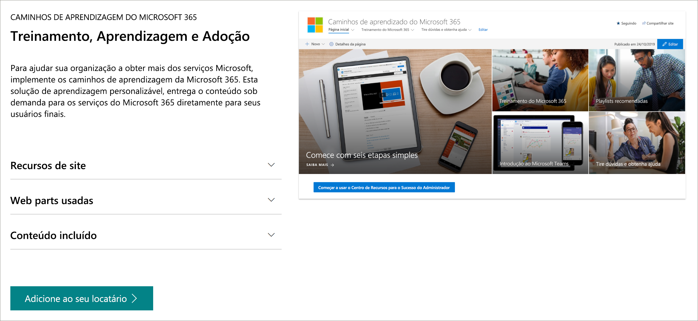

# Pré-sucursos da versão beta do Microsoft 365 LearningMicrosoft 365 learning pathways Beta Preview
Os caminhos de aprendizado da Microsoft 365 são uma solução de aprendizado personalizável e sob demanda projetada para aumentar o uso e a adoção dos serviços da Microsoft 365 em sua organização.Microsoft 365 learning pathways is a customizable, on-demand learning solution designed to increase usage and adoption of Microsoft 365 services in your organization.  

## Treinamento personalizado sob demanda da MicrosoftOn-demand, custom training from Microsoft

Os caminhos de aprendizado da Microsoft 365 oferecem:Microsoft 365 learning pathways offers:

- **Um site de comunicação do SharePoint Online totalmente personalizável** – o portal de treinamento de cursores de aprendizado pode ser personalizado para adicionar o conteúdo de ajuda, suporte e comunidade da sua organização**A fully customizable SharePoint Online communication site** - The learning pathways training portal can be customized to add your organization's help, support, and community content
- **Fácil provisionamento** -provisionar caminhos de aprendizado do serviço de provisionamento do SharePoint Online com apenas algumas etapas simples**Easy provisioning** - Provision learning pathways from the SharePoint Online Provisioning Service with just a few easy steps
- **A capacidade de criar suas próprias listas de reprodução de treinamento** – com os caminhos de aprendizado, você pode criar listas de reprodução de treinamento direcionado para atender às necessidades exclusivas de seu ambiente**The ability to create your own training playlists** - with learning pathways, you can create targeted training playlists to meet the unique needs of your environment
- Os cursores de aprendizado de **conteúdo atualizados** fornecem conteúdo por meio de um catálogo de conteúdo do Microsoft Online, portanto, o conteúdo em seu site é atualizado regularmente**Up-to-date content** - Learning pathways provides content through a Microsoft online content catalog, so the content at your site is regularly updated

## Serviço de provisionamento do SharePoint OnlineSharePoint Online Provisioning Service 
Os caminhos de aprendizado podem ser provisionados do serviço de provisionamento do SharePoint Online.Learning pathways can be provisioned from the SharePoint Online Provisioning Service. Quando os caminhos de aprendizado da Microsoft 365 são provisionados, as organizações recebem um site de comunicação do SharePoint Online projetado para ser um portal de treinamento pronto para uso, juntamente com uma Web Part de cursores de aprendizado conectada a um catálogo online de conteúdo de treinamento.When Microsoft 365 learning pathways is provisioned, organizations get a SharePoint Online communication site designed to be an out-of-the box training portal, along with a learning pathways Web part connected to an online catalog of training content. 

## 3 etapas simples3 Easy Steps
Vamos começar a criar uma experiência de cursores de aprendizado para seu ambiente.Let's get started creating a learning pathways experience for your environment.
1. Escolha uma [opção de instalação](custom_setupoptions.md) e provisione os caminhos de aprendizado do Microsoft 365.Choose a [setup option](custom_setupoptions.md) and provision Microsoft 365 learning pathways.  
2. Ajustar os caminhos de aprendizado para seu ambiente.Tailor learning pathways for your environment.
3. Compartilhe caminhos de aprendizado com seus usuários usando nossas [ferramentas de adoção](driveadoption.md).Share learning pathways with your users using our [adoption tools](driveadoption.md).

## Feedback e suporteFeedback and Support

Os caminhos de aprendizado do Microsoft 365 são um projeto de código aberto com suporte na [lista de problemas online](https://aka.ms/CustomLearningHelp) no github.Microsoft 365 learning pathways is an open source project supported through our [online issues list](https://aka.ms/CustomLearningHelp) on GitHub. A solução de caminhos do Learnng e seus componentes não são cobertos por nenhum contrato de suporte da Microsoft existente.The learnng pathways solution and it's components are not covered by any existing Microsoft support contract.  

## Recursos adicionaisAdditional Resources
Você pode usar o site de caminhos de aprendizado do Microsoft 365 para fornecer links para qualquer fórum da comunidade de usuários novos ou existentes.You can use the Microsoft 365 learning pathways site to provide links to any new or existing user community forums. É recomendável iniciar um grupo de usuários interno, se você ainda não tiver um, para permitir que as pessoas compartilhem o sucesso e aprendam uns dos outros.Consider starting an internal user group, if you don't have one already, to enable people to share their success and learn from each other.  Se você não tem tempo para promova um grupo de usuários internos, você e seus funcionários podem participar da [comunidade do Microsft Office 365 Champion](https://aka.ms/O365Champions) para obter treinamento mensal, associação à comunidade online e acesso antecipado a ferramentas e recursos para o Office 365.If you don't have time to nurture an internal user group, you and your employees can join the [Microsft Office 365 Champion community](https://aka.ms/O365Champions) for monthly training, membership in the online community, and early access to tools and resources for Office 365.