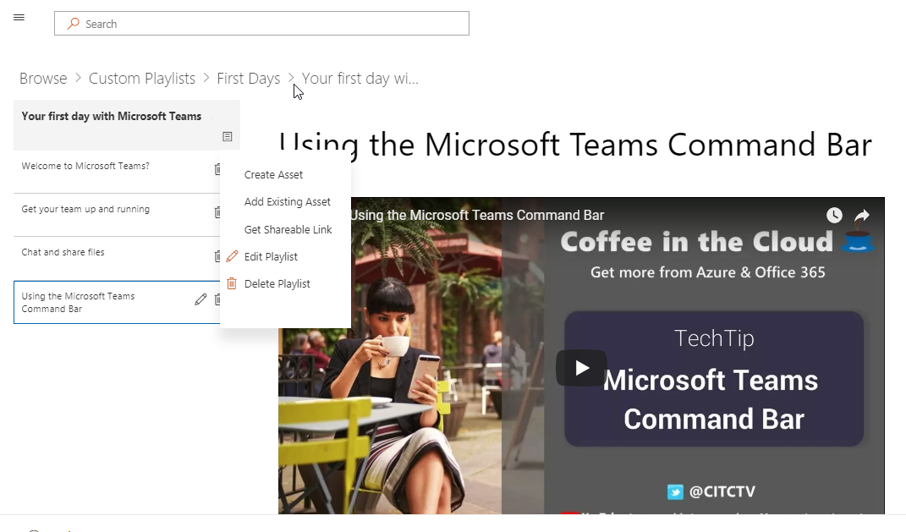

# Aprendizagem personalizada para o Office 365

## Soluções de treinamento personalizáveis e de autoatendimento da Microsoft

O aprendizado personalizado para o Office 365 é um conjunto de ferramentas de treinamento e de código aberto para aumentar o uso do Office 365 em sua organização. Criado em parceria com o Microsoft Teams e grupos de engenharia de produtos do SharePoint e com a equipe de assistência e experiência moderna, essas soluções simples de usar podem ser instaladas e personalizadas no seu locatário do SharePoint Online. 

Essas soluções trazem a todos os usuários finais o conteúdo de treinamento que a Microsoft tem a oferecer e mantém esse conteúdo atualizado sobre a demanda.  O site pode ser integrado facilmente à sua instalação do Microsoft Teams ou outros sites existentes do SharePoint Online em sua empresa.

No momento, nosso conteúdo de aprendizado personalizado está com escopo inicial para o conteúdo de produtos do Office 365 e Windows 10.  Se quiser ver mais conteúdo incluído, dê [sugestões e comentários](feedback.md) em nosso fórum online.  

## Componentes de fonte aberta de aprendizagem personalizada

O aprendizado personalizado para o Office 365 fornece duas opções: 

**Opção 1**: [pacote de site de aprendizado personalizado do SharePoint Online](installsitepackage.md)

Selecione, instale e configure este pacote de site de comunicação do SharePoint Online para criar um portal de treinamento para sua empresa. Anteriormente conhecido como kit de ferramentas para trabalho em equipe, este portal de treinamento pode ser personalizado para adicionar o conteúdo de ajuda, suporte e comunidade da sua organização. Você também pode remover qualquer conteúdo relacionado aos serviços não suportados em sua organização. O pacote de site de aprendizado personalizado também inclui a Web Part de aprendizado personalizada que oferece uma alimentação atualizada de conteúdo de treinamento do Office 365 para sua organização. 

**Opção 2**: [a Web Part aprendizagem personalizada para o Office 365](installwebpart.md) a opção de Web Part de aprendizado personalizada é projetada para organizações que desejam integrar o treinamento do Office 365 a um site de comunicação existente do SharePoint Online. A Web Part de aprendizado personalizado pode ser instalada em qualquer página do SharePoint Online e fornece um feed atualizado do pacote completo de conteúdo de treinamento do Office 365 no site do Support.Office.com da Microsoft. O conteúdo de treinamento fornecido através da Web Part é organizado em playlists de fácil utilização. Os administradores também podem usar a Web Part para criar listas de reprodução de treinamento personalizadas, combinando conteúdo do YouTube, conteúdo hospedado localmente, como. PDFs e o conteúdo de treinamento do Office 365 para fornecer experiências de treinamento adaptadas às necessidades exclusivas da organização.

## 3 etapas simples

Permite [começar](prereqs.md) a criar soluções de treinamento simples com o conteúdo atualizado da Microsoft.

1. Selecione a solução certa para você
2. Concluir a instalação & personalizar o conteúdo
3. Compartilhar seu site com seus usuários usando nossas [ferramentas de adoção](driveadoption.md)
