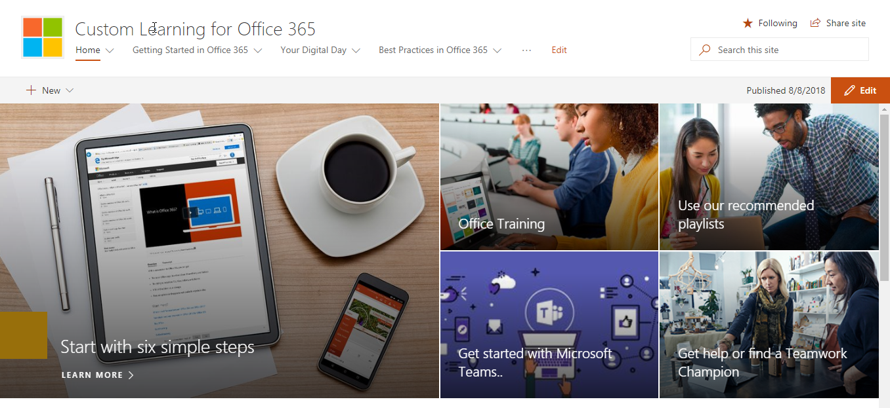

# Sinalizador de aprendizagem do Office 365Custom Learning for Office 365

## Autoatendimento, soluções de treinamento personalizável da MicrosoftSelf service, customizable training solutions from Microsoft

Sinalizador de aprendizagem do Office 365 é um conjunto de treinamento e adoção ferramentas de código aberto projetado para aumentar o uso do Office 365 em sua organização. Criado em parceria com grupos de Teams da Microsoft e de engenharia de produtos do SharePoint e a equipe de assistência moderno e experiência, essas soluções simples de usar podem ser instaladas e personalizadas no seu locatário do SharePoint Online.Custom Learning for Office 365 is a set of training and adoption open source tools designed to increase usage of Office 365 in your organization. Created in partnership with Microsoft Teams and SharePoint Product Engineering groups and the Modern Assistance and Experience team, these simple-to-use solutions can be installed and customized in your SharePoint Online tenant. 

Essas soluções geram aos seus usuários finais todo o conteúdo de treinamento que a Microsoft tem a oferecer e mantém o conteúdo atualizado sob demanda.  O site pode ser facilmente integrado com sua instalação do Microsoft Teams ou outros sites do SharePoint Online existentes na sua empresa.These solutions bring to your end-users all the training content that Microsoft has to offer and keeps that content up to date on demand.  The site can easily be integrated with your installation of Microsoft Teams or other existing SharePoint Online sites in your company.

Nosso conteúdo de aprendizado personalizado está atualmente com escopo para iniciar o conteúdo para produtos do Office 365.  Se você gostaria de ver mais conteúdo incluído, envie seus [comentários e sugestões](feedback.md) em nosso fórum online.Our custom learning content is currently scoped to beginning content for Office 365 products.  If you'd like to see more content included, give us [suggestions and feedback](feedback.md) in our online forum.  

## Componentes de código aberto aprendizado personalizadoCustom Learning Open Source Components

Sinalizador de aprendizagem do Office 365 fornece duas opções:Custom Learning for Office 365 provides two options: 

**Opção 1**: [O personalizado do SharePoint Online Site pacote de aprendizagem](installsitepackage.md)**Option 1**: [The Custom Learning SharePoint Online Site Package](installsitepackage.md)

Selecione, instalar e configurar esse pacote de site de comunicação do SharePoint Online para criar um portal de treinamento para sua empresa. Anteriormente conhecido como Toolkit para o trabalho em equipe, este portal de treinamento pode ser personalizado para adicionar conteúdo de Ajuda, suporte e comunidade da sua organização. Você também pode remover qualquer conteúdo relacionado a serviços sem suporte dentro da sua organização. O sinalizador aprendizagem pacote do site também inclui o aprendizado personalizado web part que fornece um feed atualizado do conteúdo de treinamento do Office 365 para sua organização.Select, install, and configure this SharePoint Online communication site package to create a training portal for your company. Formerly known as Toolkit for Teamwork, this training portal can be customized to add your organization's help, support, and community content. You can also remove any content related to services not supported within your organization. The custom learning site package also includes the Custom Learning web part that provides an up-to-date feed of Office 365 training content to your organization. 

**Opção 2**: opção de parte da web [O aprendizado de sinalizador para Office 365 web part](installwebpart.md) o sinalizador Learning destina-se para as organizações que desejam integrar a um site existente do SharePoint Online comunicação de treinamento do Office 365. A web part de aprendizado personalizado pode ser instalada em qualquer página do SharePoint Online e fornece um feed atualizado do pacote completo de conteúdo de treinamento do Office 365 do site de Support.Office.com da Microsoft. Treinamento fornecido por meio de web part de conteúdo está organizado em listas de reprodução consumir. Os administradores também podem usar a web part para criar listas de reprodução de treinamento personalizado, a combinação de conteúdo de YouTube, conteúdo hospedado localmente, como. PDF e o conteúdo de treinamento do Office 365, para fornecer treinamento experiências de acordo com as necessidades exclusivas da organização.**Option 2**: [The Custom Learning for Office 365 web part ](installwebpart.md) The Custom Learning web part option is designed for organizations that want to integrate Office 365 training into an existing SharePoint Online communication site. The Custom Learning web part can be installed on any SharePoint Online page and provides an up-to-date feed of the full suite of Office 365 training content from Microsoft's Support.Office.com site. Training content delivered through the web part is organized in easy-to-consume playlists. Administrators can also use the web part to build custom training playlists, combining content from YouTube, locally hosted content like .PDFs, and Office 365 training content, to provide training experiences tailored to the unique needs of the organization.

## 4 etapas simples4 Easy Steps

Permite a [Introdução](getstarted.md) criando uma solução de treinamento simples com o Microsoft atualizado conteúdo.Lets [get started](getstarted.md) creating a simple training solutions with up to date Microsoft content.

1. Selecione o direito de solução para vocêSelect the solution right for you
2. Personalizar sua & de instalação completa seu conteúdoComplete your installation & customize your content
3. Compartilhar seu site com seus usuários usando nossas [Ferramentas de adoção](driveadoption.md)Share your site with your users using our [adoption tools](driveadoption.md)
