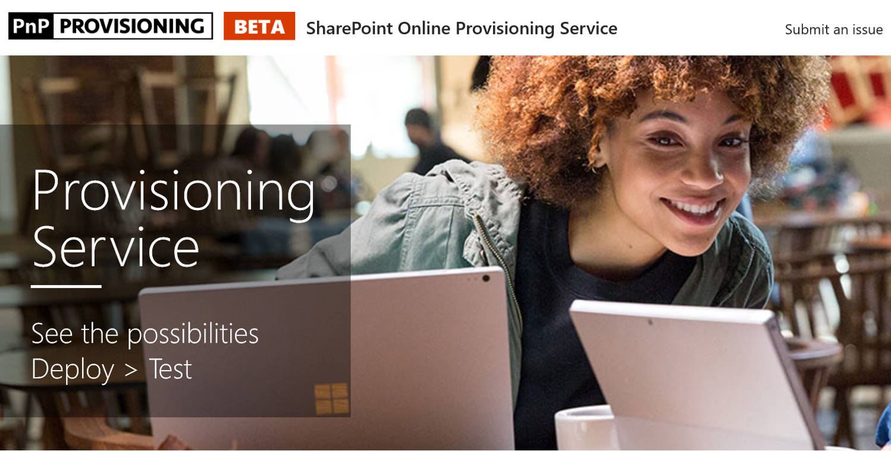

# Provisionar o sinalizador Site de aprendizagemProvision the Custom Learning Site

1. Vá para http://provisioning.sharepointpnp.com e entrar usando suas credenciais para o destino de inquilinos planeja usar para a instalação. Go to http://provisioning.sharepointpnp.com and sign in using your credentials for the targeted tenant you plan on using for the installation. 
1. Marque os consentimento em nome de sua organização e selecione aceitar.Check off Consent on behalf of your organization and select Accept.
1. Selecione o aprendizado personalizado para o Office 365 da Galeria de soluções.Select Custom Learning for Office 365 from the solution gallery. 
1. Selecione Adicionar ao seu locatárioSelect Add to your Tenant 
1. Ajuste seleções padrão na página provisionamento conforme necessário e selecione provisão quando estiver pronto para instalar o CLO365 em seu ambiente de locatário.Adjust default selections on the provisioning page as required and select Provision when ready to install CLO365 into your tenant environment.  
1. O processo de provisionamento levará até 15 minutos. Você será notificado por email (para o endereço de email de notificação que você inseriu na página provisionamento) quando o site está pronto para acesso.The provisioning process will take up to 15 minutes. You will be notified via email (to the notification email address you entered on the Provisioning page) when the site is ready for access. 
1. Uma vez conectado ao CLO365 no seu locatário, favorito o site e copie a url para referência futura.Once logged on to CLO365 in your tenant, favorite the site and copy the url for future reference.  

## Próximas etapasNext Steps
- Explore o [conteúdo padrão](sitecontent.md) incluído na Web Part de.Explore the [default content](sitecontent.md) included in the webpart.
- [Personalizar](customization.md) a experiência de treinamento para sua organização.[Customize](customization.md) the training experience for your organization.
- [Direcionar a adoção](driveadoption.md) da sua solução de treinamento.[Drive adoption](driveadoption.md) of your training solution.

