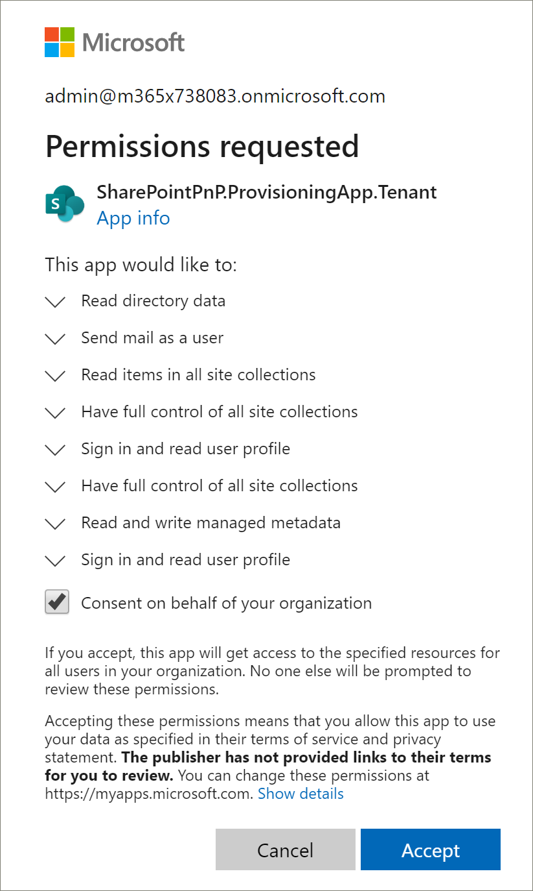
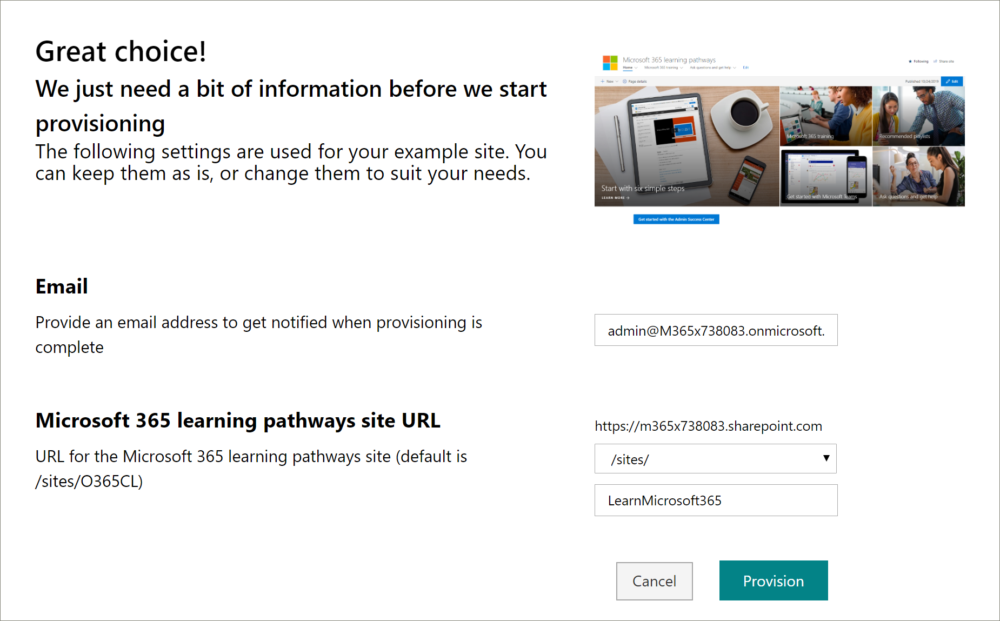

# ProVisionar o site de aprendizado personalizadoProvision the Custom Learning Site

1. Vá para http://provisioning.sharepointpnp.com e **entre** no canto superior direito da Home Page.  Entre com as credenciais do locatário de destino no qual você planeja instalar o modelo de site.Go to http://provisioning.sharepointpnp.com and **sign in** from the upper right hand corner of the home page.  Sign in with the  credentials for the targeted tenant where you plan to install the site template.

2. DesMarque o **consentimento em nome da sua organização** e selecione **aceitar**.Clear the **Consent on behalf of your organization** and select **Accept**.

3. Selecione **aprendizagem personalizada para o Office 365** na Galeria de soluções.Select **Custom Learning for Office 365** from the solution gallery.

4. Na página inicial da solução, selecione **Adicionar ao seu locatário**From the solution home page select **Add to your Tenant**

5. Preencha os campos da página informações de provisionamento, conforme apropriado para sua instalação. No mínimo, insira o endereço de email para o qual você deseja obter notificações sobre o processo de provisionamento e a URL de destino do seu site a ser provisionado.Complete the fields on the provisioning information page as appropriate for your installation. At a minimum enter the email address where you wish to get notifications about the provisioning process and the destination URL for your site to be provisioned to.  

> [!NOTE]
> Torne a URL de destino do seu site um tanto amigável para seus funcionários, como "/sites/MyTraining" ou "/teams/LearnOffice365".Make the destination URL for your site something friendly to your employees such as "/sites/MyTraining" or "/teams/LearnOffice365".

6. Selecione \*\*\*\* provisionar quando estiver pronto para instalar o CLO365 em seu ambiente de locatário.  O processo de provisionamento levará até 15 minutos. Você será notificado por email (para o endereço de email de notificação que você inseriu na página de provisionamento) quando o site estiver pronto para o Access.Select **Provision** when ready to install CLO365 into your tenant environment.  The provisioning process will take up to 15 minutes. You will be notified via email (to the notification email address you entered on the Provisioning page) when the site is ready for access.

7. Quando você tiver sido notificado de que o provisionamento está concluído, navegue até a URL de destino inserida na página de provisionamento.When you have been notified that provisioning is complete browse to the destination URL you entered in the Provisioning page.

8. Favorito o site no canto superior direito e marque a URL para referência futura.Favorite the site in the upper right hand corner and bookmark the URL for future reference.  

### Próximas etapasNext Steps
- Explore o [conteúdo padrão](sitecontent.md) incluído na Web Part.Explore the [default content](sitecontent.md) included in the webpart.
- [Personalizar](customization.md) a experiência de treinamento da sua organização.[Customize](customization.md) the training experience for your organization.
- [Impulsionar a adoção](driveadoption.md) de sua solução de treinamento.[Drive adoption](driveadoption.md) of your training solution.
