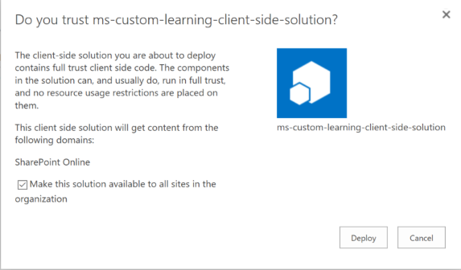
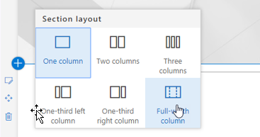
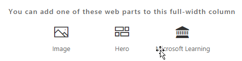

# Instalando a Web Part de solução de aprendizado personalizada

## Pré-requisitos para uma instalação em todo o locatário

- Para instalar o Web Part de aprendizado personalizado para o seu locatário inteiro, você precisará ter permissões administrativas do Office 365.  Se você não tiver essas permissões, poderá trabalhar com o administrador do Office 365 ou instalar a Web Part para um conjunto de sites individual.
- Você ou seu administrador do Office 365 deve ter a configuração e configurado um [Catálogo de aplicativos](https://docs.microsoft.com/en-us/sharepoint/dev/spfx/set-up-your-developer-tenant) em todo o locatário ou um catálogo de aplicativos do [conjunto de sites](https://docs.microsoft.com/en-us/sharepoint/dev/general-development/site-collection-app-catalog)para receber a Web Part.]
- Oferecemos suporte somente ao SharePoint Online. A Web Part não é compatível com a instalação em qualquer versão do SharePoint local.

## Adicionar a Web Part de aprendizado personalizada ao seu locatário 

1. Baixe o Web Part de aprendizado personalizado e salve-o em sua unidade local.  Esse arquivo é chamado de "MS-Custom-Learning. sppkg".  Não altere o nome nem o sufixo do arquivo. 
2. Navegue até o [portal de administração do Office 365](https://admin.microsoft.com/AdminPortal/Home#/homepage) para o locatário
3. Na navegação à esquerda, selecione centros de administração, SharePoint. Isso será aberto em uma nova guia. no centro de administração do SharePoint, selecione aplicativos, catálogo de aplicativos, aplicativos para SharePoint 
4. Selecione carregar a Web Part e escolha o arquivo "MS-Custom-Learning. sppkg" que você baixou
5. Para esta instalação em todo o locatário, marque a caixa ao lado de "tornar esta solução disponível para todos" na organização.  
 
> [!NOTE]
> Após instalar o WebPart, você o encontrará na Galeria de Web Parts no SharePoint Online.  **Na Galeria, a Web Part é chamada "Microsoft Learning"**

## Adicionar a Web Part do Microsoft Learning a uma página do SharePoint Online

Após o aprendizado personalizado ser instalado em seu locatário, você pode adicionar a Web Part a uma página do SharePoint. Quando você faz o treinamento do Office 365 e do Windows 10 está disponível para seu site.

1. Adicione a Web Part de aprendizado personalizada em um layout de coluna de largura total:

2. Na página do SharePoint, selecione Adicionar seção e, em seguida, selecione coluna de largura total.  Você verá o seguinte prompt:

3. Selecione Microsoft Learning.  Agora você deve ver o seguinte: 

 Agora você pode clicar nos blocos para explorar o conteúdo padrão incluído na solução.  

### Próximas etapas
- Explore o [conteúdo padrão](webpartcontent.md) incluído na Web Part.
- [Personalizar](customization.md) a experiência de treinamento da sua organização.
- [Impulsionar a adoção](driveadoption.md) de sua solução de treinamento.

