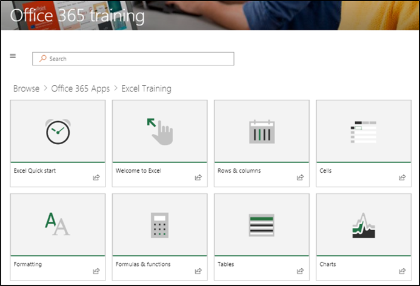
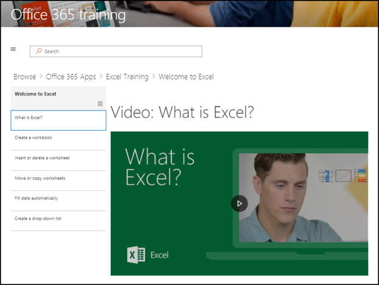

# Explorar o site e o conteúdo padrão

### Tour pelo site 

Navegue até a página inicial e selecione treinamento do Office 365. Cada página no site do SharePoint Online é configurada para hospedar a Web Part do Microsoft Learning. Isso permite que a página exiba todo o conteúdo disponível na Web Part.

Na barra de menus, selecione o item de navegação **treinamento do Office 365** e selecione **introdução ao onedrive**. Nesse caso, a Web Part filtra o conteúdo para mostrar apenas o conteúdo do OneDrive.

Repita essas etapas para as outras duas opções de menu, **comece** a usar o Microsoft Teams e comece a usar o **SharePoint Online** para revisar o conteúdo e testar a navegação.

Navegue de volta para a Home Page e selecione **Iniciar com seis etapas simples**. Isso leva você para a seis lista de reprodução simples de etapas.

> [!TIP]
> As seis etapas simples são derivadas de uma equipe de pesquisa da Microsoft. Estas são as etapas que os pesquisadores da Microsoft descobriram ser a mais adesiva, o que significa que os usuários passam por essas etapas, o uso do Office 365 aumentará e se tornará funcionários mais produtivos. E isso é bom para todos.

### Vá para começar com seis etapas simples
- Na Home Page, clique em iniciar com seis etapas simples. 
- Você vê a página de treinamento do Office com a Web Part de aprendizado personalizada encaminhada para a lista de reprodução de etapas de início com seis etapas simples.  

### Exibir uma lista de playlists para uma categoria

Na página treinamento do Office 365, selecione treinamento do Excel para acessar uma lista de playlists de treinamento do Excel.

### Exibir uma lista de reprodução

Clique em **Bem-vindo ao Excel** para exibir a lista de reprodução

Agora, o site está configurado com o conteúdo correto exibido em cada página. 

## Próximas etapas
- [Personalizar conteúdo do site](customization.md)
- [Adoção de drive](driveadoption.md) 
