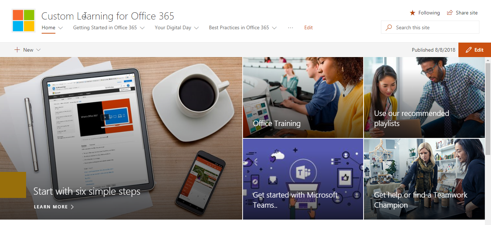
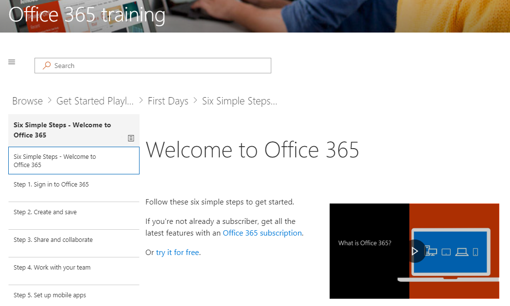

# Navegar no conteúdo do site e padrãoBrowse the site and default content

Agora que você instalou CLO365, é hora de fazer um tour do site.Now that you’ve installed CLO365, it’s time to take a tour of the site. 

1. Navegue até a Home page e selecione o treinamento do Office 365. Isso exibirá a todo o conteúdo disponível dentro da Web part.Navigate to the Home page and select Office 365 Training. This will display all the content available within the Web part.

2. Na barra de menu, aponte para o treinamento do Office 365 e selecione Introdução ao OneDrive. Nesse caso, a Web part filtra o conteúdo para mostrar somente OneDrive conteúdo, conforme mostrado na ilustração a seguir.From the menu bar, point to Office 365 Training and then select Get Started with OneDrive. In this case, the Web part filters the content to show only OneDrive content, as shown in the following illustration.

{Inserir imagem}{insert image}

3. Repita essas etapas para as outras duas opções de menu, começar com equipes e introdução ao SharePoint Online para examinar seu conteúdo e testar o painel de navegação.Repeat these steps for the other two menu options, Get Started with Teams and Get Started with SharePoint Online to review their content and test the navigation.

{Inserir imagem}{insert image} 

4. Navegue de volta para a Home page e selecione Iniciar com seis etapas simples. Isso leva você à lista de reprodução de seis etapas simples conforme mostrado na ilustração a seguir.Navigate back to the Home page and select Start with Six Simple Steps. This takes you to the Six Simple Steps playlist as shown in the following illustration.  

> [!TIP]
> As seis etapas simples são derivadas de uma equipe de pesquisa da Microsoft. Essas são as etapas que pesquisadores Microsoft determinamos para ser mais adesivo, que significa que se os usuários passam por essas etapas, seu uso do Office 365 aumentará e eles se tornará funcionários mais produtivos. E o que é bom para todas as pessoas.The six simple steps are derived from a Microsoft research team. These are the steps that Microsoft researchers have found to be the most sticky, meaning if users go through these steps, their use of Office 365 will increase and they will become more productive workers. And that’s good for everybody.

Vá para iniciar com seis etapas de simplesGo to Start with six simple steps
- Na Home page, clique em Iniciar com seis etapas simples.From the Home page, click Start with six simple steps. 
- Você verá a página de treinamento do Office com a web part de aprendizado personalizado roteada para o início com a lista de reprodução seis etapas simples.You see the Office Training page with the Custom Learning web part routed to the Start with six simple steps playlist.  

Agora a seu site está configurado com o conteúdo correto seja exibido em cada página. Se você gostaria de personalizar o conteúdo de treinamento do site, consulte Custom aprendizagem para o guia do administrador do Office 365 para personalização.Your site is now set up with the correct content being displayed on each page. If you would like to customize the training content on the site, please see Custom Learning for Office 365 Administrator Guide to Customization. 

## Próximas etapasNext Steps
[Personalizar o conteúdo do site](customization.md)
[direcionar a adoção](driveadoption.md)[Customize site content](customization.md)
[Drive adoption](driveadoption.md) 
