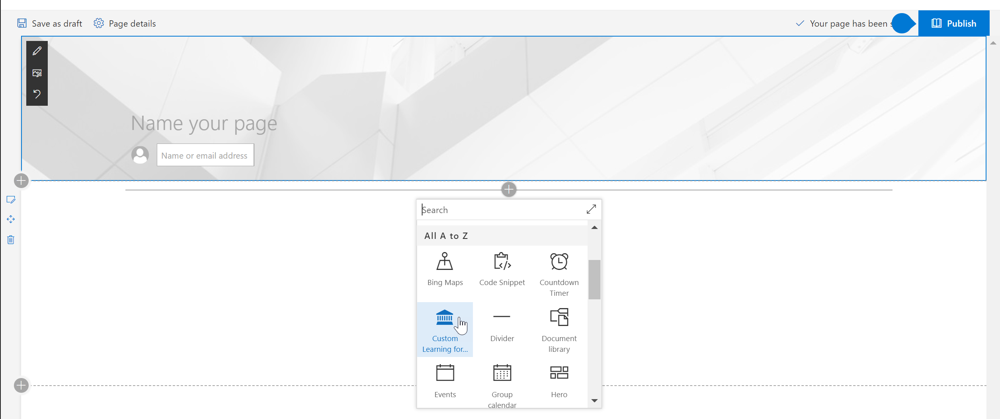
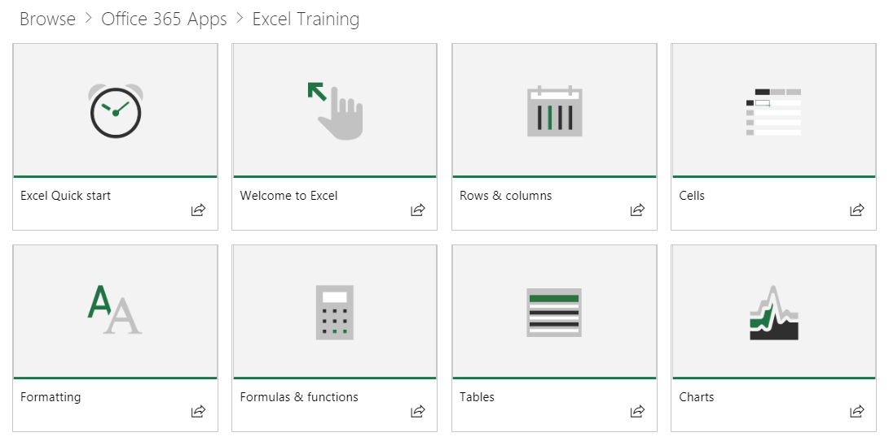
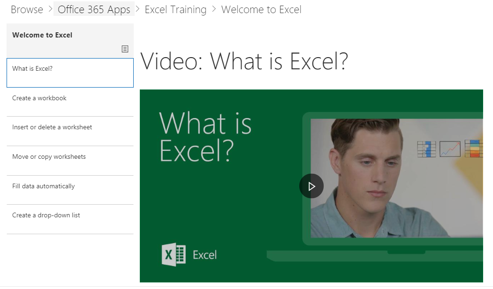

# Conteúdo padrão da Webpart

## O modelo de playlist

Nossa webpart usa um modelo de playlist familiar para organizar o conteúdo.  Esse modelo é simples para os usuários finais entenderem e para você personalizar, caso você escolha.  A personalização não é necessária.  Nossa experiência completa fornece conteúdo de treinamento eficaz com base em nossa pesquisa extensiva.

Essas playlists foram projetadas para ajudar as organizações a adaptar a experiência de aprendizado para os usuários e apresentá-los com playlists fáceis de consumir para ensinar a eles comportamentos novos e mais produtivos. O conteúdo serve de Support.Office.com, e os ativos são curtos e ativos, com vídeos atraentes e atraentes. 

Cada tile representa uma lista de reprodução em destaque individual ou uma categoria de conteúdo. Clicar em qualquer playlist ou grupo de categorias navega rapidamente pelo usuário até a área selecionada. O gráfico a seguir mostra as listas em destaque nas categorias "Começar Playlist" e Aplicativo do Office 365, como Excel, Microsoft Teams e outros. 

Clicar na categoria do Excel, por exemplo, os navega até uma coleção de playlists.  Eles podem assistir ao conteúdo em ordem ou selecionar o que os interessa com base em suas necessidades de aprendizado. 

Exibição de playlist selecionada

## Próximas Etapas

- Navegue e se familiarize com o conteúdo existente
- Ocultar e mostrar playlists [personalizar listas de reprodução](custom_hideshowplaylists.md)
